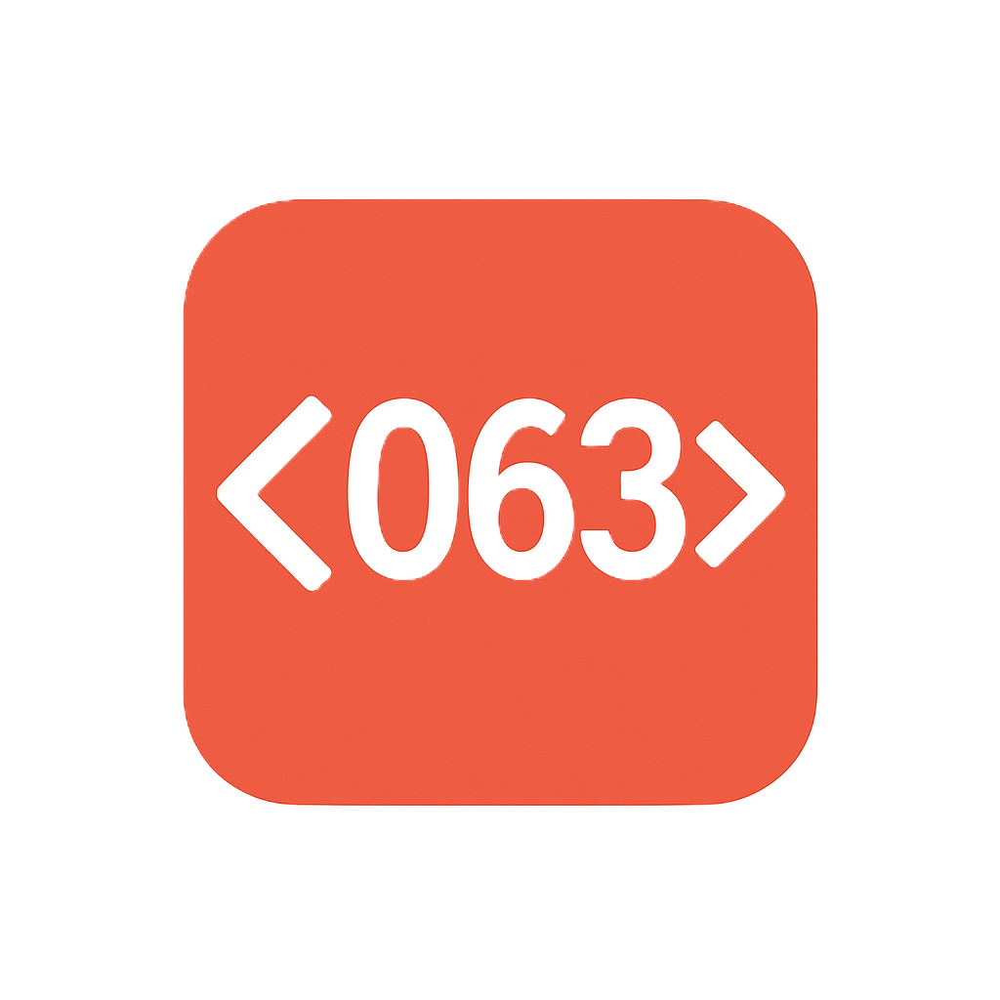

<div align="center">
    <picture>
      
    </picture>
  <h1>c063</h1>

<div style="display: flex; justify-content: center">
<a href="https://www.npmjs.com/package/c063"></a>
<a href="./LICENSE"></a></div>
</div>

---

A highly customizable React component library for displaying syntax-highlighted code snippets. Supports multiple languages and themes, making it ideal for documentation, blogs, or educational platforms.

## ✨ Project Overview

**c063** is a syntax highlighting component built with React and TypeScript. It offers flexible theming and a modular architecture that makes it easy for developers to embed code blocks into their applications.

## ⚡️ Features

- ✏️ Display code snippets with syntax highlighting.
- 🌟 Multiple theme support: GitHub, Visual Studio, Light/Dark, etc.
- 🔄 Modular design for easy integration and customization.
- 📖 Perfect for tutorials, blog posts, and educational content.

## 🚀 Installation & Usage

### Installation

```bash
npm install c063
```

### Usage Example

```tsx
import { CodeBlock } from "c063";

const tokens = [
  [
    { type: "keyword1", children: "const" },
    { type: "default", children: " " },
    { type: "variable", children: "x" },
    { type: "default", children: " = " },
    { type: "number", children: "42" },
  ],
];

<CodeBlock tokenLines={tokens} theme="github-light" />;
```

## 📂 Project Structure

```txt
src
├── components/         # Component files
│   ├── CodeBlock.tsx   # Code block container
│   ├── CodeLine.tsx    # Single line component
│   ├── CodeToken.tsx   # Individual token component
├── libs/               # Theme and configuration
│   └── themes/         # Color themes
├── types/              # Type definitions
├── utils/              # Utility functions and parsers
└── index.ts            # Module export entry
```

## 🔍 API / Props Reference

### `CodeBlock<T>`

```ts
interface CodeBlockProps<T extends React.ElementType> {
  tokenLines: CodeTokenProps<T>[][];
  showLineNumbers?: boolean; // Default true
  lineNumberStyle?: React.CSSProperties;
  theme?: CodeTheme; // e.g. "github-dark"
  autoWrap:? boolean;
}
```

### `CodeLine<T>`

```ts
interface CodeLineProps<T extends React.ElementType> {
  tokens: CodeTokenProps<T>[];
  theme?: CodeTheme;
  autoWrap:? boolean;
}
```

### `CodeToken<T>`

```ts
interface CodeTokenProps<T extends React.ElementType> {
  type?: CodeTokenType;
  theme?: CodeTheme;
  children: React.ReactNode;
  as?: T; // Custom rendering tag
}
```

### Utilities

- `c063.<type>()`: Quickly create tokens, e.g., `c063.keyword1("const")`.
- `whiteSpace(count)`: Insert a specific number of whitespace tokens.

## ✍️ Contributing

All contributions are welcome, including but not limited to:

- Bug fixes or performance improvements
- New theme submissions
- Support for more programming languages

Before submitting a PR, please fork the repository and create a new branch for your changes.

## 📄 License

This project is licensed under the [MIT](./LICENSE) license.

---

Repository:

[https://github.com/fanyuuu2006/c063](https://github.com/fanyuuu2006/c063)
