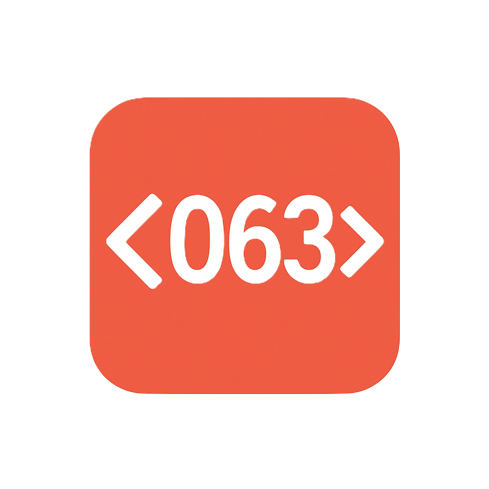

<div align="center">
  <picture>
    
  </picture>

  <h1>c063</h1>

  <p>🎨 輕量、主題豐富、可高度自定義的 React 語法高亮元件庫</p>

  <div>
    <a href="https://www.npmjs.com/package/c063">
      
    </a>
    <a href="https://www.npmjs.com/package/c063">
      
    </a>
    <a href="./LICENSE">
      
    </a>
    
    
  </div>
</div>

---

**c063** 是一款以 React + TypeScript 打造的語法高亮元件庫，提供 `<CodeBlock />`、`<CodeLine />`、`<CodeToken />` 三層式元件架構，以及 `c063` token 建構器。

內建 12 款精選主題（涵蓋 VS Code、GitHub 的亮色與暗色系列），讓你在文件網站、技術部落格、互動教學平台中，快速嵌入精美的程式碼區塊——完全不依賴 Prism.js 或 highlight.js 等外部 runtime。

---

## ✨ Features

| 特色                    | 說明                                                                   |
| ----------------------- | ---------------------------------------------------------------------- |
| 🎨 12 款內建主題        | 涵蓋 VS Code Dark/Light Modern、GitHub Dark/Light 及其 Colorblind 變體 |
| 🧩 三層元件架構         | `CodeBlock` → `CodeLine` → `CodeToken`，粒度靈活，按需組合             |
| ⚡ `c063` 建構器        | Proxy-based 的 token 工廠，以 `c063.keyword1("const")` 快速建立 token  |
| 🔢 行號顯示             | 內建行號欄位，可開關並自訂樣式                                         |
| 🔗 `as` prop 支援       | 每個元件可替換底層 HTML 元素或 React 元件，保留完整型別推導            |
| 🔷 完整 TypeScript      | 附帶 `.d.ts`，精確泛型推導，無需額外安裝 `@types/*`                    |
| 📦 零額外 Runtime       | 不依賴 Prism、highlight.js 或任何第三方解析引擎                        |

---

## 📦 Installation

```bash
# npm
npm install c063
```

> **Peer Dependencies**：需自行安裝 `react >= 19` 與 `react-dom >= 19`。

---

## 🚀 Quick Start

30 秒內顯示第一個語法高亮程式碼區塊：

```tsx
import { CodeBlock, c063, whiteSpace } from "c063";

const tokenLines = [
  [
    c063.keyword1("const"),
    whiteSpace(),
    c063.variable("greeting"),
    whiteSpace(),
    c063.operator("="),
    whiteSpace(),
    c063.string('"Hello, World!"'),
    c063.default(";"),
  ],
];

export default function App() {
  return (
    <div style={{ background: "#1e1e1e", padding: 16, borderRadius: 8 }}>
      <CodeBlock
        tokenLines={tokenLines}
        theme="default-dark-modern"
        showLineNumbers
      />
    </div>
  );
}
```

**輸出效果：** 帶行號、關鍵字藍色、字串橘色的程式碼區塊。

---

## 📖 Usage

### 方式一：`c063` 建構器（手動精確控制）

需要精確控制每個 token 的類型與樣式時使用。

```tsx
import { CodeBlock, c063, whiteSpace } from "c063";

const tokenLines = [
  [
    c063.keyword1("const"),
    whiteSpace(),
    c063.variable("PI"),
    whiteSpace(),
    c063.operator("="),
    whiteSpace(),
    c063.number("3.14"),
    c063.default(";"),
  ],
  [c063.comment("// 圓周率常數")],
];

<CodeBlock tokenLines={tokenLines} theme="default-dark-modern" />;
```

---

### 方式二：手動組合元件

需要完整控制佈局與行為時，可直接使用底層元件。

```tsx
import { CodeLine, CodeToken } from 'c063';

// 顯示單行程式碼
<CodeLine
  theme="default-dark-modern"
  tokens={[
    { type: 'keyword1', children: 'return' },
    { type: 'default', children: ' ' },
    { type: 'number', children: '42' },
    { type: 'default', children: ';' },
  ]}
/>

// 顯示單一 token
<CodeToken type="string" theme="github-light">
  'Hello'
</CodeToken>
```

---

### 切換主題

```tsx
import { CodeBlock, c063, whiteSpace } from 'c063';

const tokenLines = [
  [c063.keyword1("const"), whiteSpace(), c063.variable("x"), whiteSpace(), c063.operator("="), whiteSpace(), c063.number("1"), c063.default(";")],
];

// 暗色主題
<CodeBlock tokenLines={tokenLines} theme="github-dark" />

// 亮色主題
<CodeBlock tokenLines={tokenLines} theme="github-light" />
```

---

## 🔌 API Reference

### `<CodeBlock />`

顯示完整多行程式碼區塊，內建行號欄位，以 `<pre>` + `<table>` 結構確保行號對齊。

```ts
type CodeBlockProps<T extends React.ElementType = "span"> = {
  /** 所有程式碼行的 token 二維陣列（必填） */
  tokenLines: CodeTokenProps<T>[][];
  /** 是否顯示行號。預設 true */
  showLineNumbers?: boolean;
  /** 行號欄位的自訂樣式 */
  lineNumberStyle?: React.CSSProperties;
  /** 語法主題名稱。預設 "default-dark-modern" */
  theme?: CodeTheme;
  /** 是否自動換行。預設 true */
  autoWrap?: boolean;
} & React.HTMLAttributes<HTMLPreElement>;
```

**Props 一覽**

| Prop              | 型別                  | 預設                    | 說明                          |
| ----------------- | --------------------- | ----------------------- | ----------------------------- |
| `tokenLines`      | `CodeTokenProps[][]`  | —                       | 每行為一個 token 陣列（必填） |
| `showLineNumbers` | `boolean`             | `true`                  | 是否顯示行號欄位              |
| `lineNumberStyle` | `React.CSSProperties` | `{ color: "#888" }`     | 行號欄位的樣式                |
| `theme`           | `CodeTheme`           | `"default-dark-modern"` | 語法高亮主題                  |
| `autoWrap`        | `boolean`             | `true`                  | 是否自動換行                  |

---

### `<CodeLine />`

渲染單一程式碼行，包含多個 `<CodeToken />`，以 `<code>` 包裹。

```ts
type CodeLineProps<T extends React.ElementType = "span"> = {
  /** 該行所包含的語法 token 陣列（必填） */
  tokens: CodeTokenProps<T>[];
  /** 語法主題名稱 */
  theme?: CodeTheme;
  /** 是否自動換行。預設 true */
  autoWrap?: boolean;
} & React.HTMLAttributes<HTMLElement>;
```

---

### `<CodeToken />`

渲染單一語法 token，以 `<span>`（或自訂元素）輸出帶有語法顏色的文字。使用 `React.memo` 優化重渲染。

```ts
type CodeTokenProps<T extends React.ElementType = "span"> = {
  /** 語法類型，對應主題顏色。預設 "default" */
  type?: CodeTokenType;
  /** 語法主題名稱。預設 "default-dark-modern" */
  theme?: CodeTheme;
  /** 顯示內容 */
  children?: React.ReactNode;
  /** 替換底層渲染元素 */
  as?: T;
} & React.ComponentPropsWithRef<T>;
```

---

### `c063` — Token 建構器

Proxy-based 的語法 token 工廠，以 `c063.<type>(children, props?)` 建立 token 物件。

```ts
// TypeScript Signature
const c063: Record<CodeTokenType, CodeTokenBuilder>;

type CodeTokenBuilder = <T extends React.ElementType = "span">(
  children: React.ReactNode,
  props?: CodeTokenProps<T>,
) => CodeTokenProps<T>;
```

**使用範例**

```ts
import { c063 } from "c063";

c063.keyword1("const");
// => { type: 'keyword1', children: 'const' }

c063.string("'Hello'", { as: "code" });
// => { type: 'string', children: "'Hello'", as: 'code' }

c063.comment("// 這是註解");
// => { type: 'comment', children: '// 這是註解' }
```

> ⚠️ 傳入不存在的型別鍵時會拋出 `Error: Invalid CodeTokenType: <key>`。

---

### `whiteSpace(count?)` — 空白 Token

產生指定數量空白字元的 token，用於縮排或空格。

```ts
// TypeScript Signature
const whiteSpace: (count?: number) => CodeTokenProps<"span">;
```

```ts
import { whiteSpace } from "c063";

whiteSpace(); // => { type: 'default', children: ' ' }
whiteSpace(4); // => { type: 'default', children: '    ' }
```

---

### 其他工具函式

| 函式                  | 簽名                                                                     | 說明                                  |
| --------------------- | ------------------------------------------------------------------------ | ------------------------------------- |
| `isCodeTokenType`     | `(value: any) => value is CodeTokenType`                                 | 驗證是否為合法的 `CodeTokenType`      |
| `extractTokenContent` | `(token: CodeTokenProps) => string`                                      | 遞迴提取 token 的純文字內容           |
| `isTokenEqual`        | `(a, b: CodeTokenProps) => boolean`                                      | 比較兩個 token 的 type 與內容是否相同 |
| `groupTokensByType`   | `(lines: CodeTokenProps[][]) => Record<CodeTokenType, CodeTokenProps[]>` | 將所有 token 按語法類型分類           |

---

## 💡 Examples

### 基本：手動 token + `default-dark-modern`

```tsx
import { CodeBlock, c063, whiteSpace } from "c063";

const tokenLines = [
  [
    c063.keyword1("import"),
    whiteSpace(),
    c063.brackets1("{"),
    whiteSpace(),
    c063.variable("useState"),
    whiteSpace(),
    c063.brackets1("}"),
    whiteSpace(),
    c063.keyword1("from"),
    whiteSpace(),
    c063.string("'react'"),
    c063.default(";"),
  ],
];

export function Demo() {
  return (
    <div style={{ background: "#1e1e1e", borderRadius: 8, padding: 16 }}>
      <CodeBlock tokenLines={tokenLines} theme="default-dark-modern" />
    </div>
  );
}
```

---

### 進階：自訂行號樣式 + 關閉自動換行

```tsx
import { CodeBlock, c063, whiteSpace } from "c063";

const tokenLines = [
  [c063.keyword1("function"), whiteSpace(), c063.function("add"), c063.brackets1("("), c063.variable("a"), c063.default(","), whiteSpace(), c063.variable("b"), c063.brackets1(")")],
  [whiteSpace(2), c063.keyword1("return"), whiteSpace(), c063.variable("a"), whiteSpace(), c063.operator("+"), whiteSpace(), c063.variable("b"), c063.default(";")],
  [c063.brackets3("}")],
];

export function AdvancedDemo() {
  return (
    <CodeBlock
      tokenLines={tokenLines}
      theme="github-dark"
      showLineNumbers
      lineNumberStyle={{ color: "#555", paddingInline: "1rem" }}
      autoWrap={false}
      style={{ fontSize: 14, fontFamily: "Fira Code, monospace" }}
    />
  );
}
```

---

### React：主題切換器

```tsx
import { useState } from "react";
import { CodeBlock, c063, whiteSpace, CodeTheme } from "c063";

const themeOptions: CodeTheme[] = [
  "default-dark-modern",
  "github-dark",
  "github-light",
  "visual-studio-light",
];

const tokenLines = [
  [c063.keyword1("const"), whiteSpace(), c063.variable("x"), whiteSpace(), c063.operator("="), whiteSpace(), c063.string('"Hello, World!"'), c063.default(";")],
];

export function ThemeSwitcher() {
  const [theme, setTheme] = useState<CodeTheme>("default-dark-modern");

  return (
    <div>
      <select
        value={theme}
        onChange={(e) => setTheme(e.target.value as CodeTheme)}
      >
        {themeOptions.map((t) => (
          <option key={t} value={t}>
            {t}
          </option>
        ))}
      </select>
      <CodeBlock tokenLines={tokenLines} theme={theme} />
    </div>
  );
}
```

---

### Next.js（App Router）

```tsx
// app/components/CodeDisplay.tsx
"use client";

import { CodeBlock, c063, whiteSpace } from "c063";

interface Props {
  tokenLines: CodeTokenProps[][];
}

export function CodeDisplay({ tokenLines }: Props) {
  return (
    <div style={{ borderRadius: 8, overflow: "hidden" }}>
      <CodeBlock tokenLines={tokenLines} theme="github-dark" />
    </div>
  );
}
```

---

### 工具函式：分析 token 組成

```ts
import { groupTokensByType, extractTokenContent, c063, whiteSpace } from "c063";

const lines = [
  [c063.keyword1("const"), whiteSpace(), c063.variable("PI"), whiteSpace(), c063.operator("="), whiteSpace(), c063.number("3.14"), c063.default(";"), whiteSpace(), c063.comment("// 圓周率")],
];
const grouped = groupTokensByType(lines);

console.log(grouped.keyword1.map(extractTokenContent));
// => ['const']

console.log(grouped.number.map(extractTokenContent));
// => ['3.14']

console.log(grouped.comment.map(extractTokenContent));
// => ['// 圓周率']
```

---

## ⚙️ Configuration

### `CodeTheme` — 可用主題

| 主題名稱                  | 風格                     |
| ------------------------- | ------------------------ |
| `default-dark-modern`     | VS Code 深色現代（預設） |
| `default-dark`            | VS Code 深色             |
| `default-dark-plus`       | VS Code 深色加強         |
| `default-light-modern`    | VS Code 亮色現代         |
| `default-light-plus`      | VS Code 亮色加強         |
| `visual-studio-light`     | Visual Studio 亮色       |
| `github-dark`             | GitHub 深色              |
| `github-dark-default`     | GitHub 深色預設          |
| `github-dark-colorblind`  | GitHub 深色色盲模式      |
| `github-light`            | GitHub 亮色              |
| `github-light-default`    | GitHub 亮色預設          |
| `github-light-colorblind` | GitHub 亮色色盲模式      |

---

### `CodeTokenType` — Token 類型對照

| 類型        | 說明               | 範例                        |
| ----------- | ------------------ | --------------------------- |
| `keyword1`  | 控制流、宣告關鍵字 | `const`, `return`, `import` |
| `keyword2`  | 值關鍵字、內建物件 | `true`, `null`, `undefined` |
| `function`  | 函式名稱           | `fetch`, `console`          |
| `string`    | 字串常值           | `'text'`, `` `template` ``  |
| `number`    | 數字常值           | `42`, `3.14`                |
| `comment`   | 註解               | `// ...`, `/* ... */`       |
| `type`      | 型別定義           | `interface`, `enum`         |
| `variable`  | 變數、識別符號     | `myVar`, `ClassName`        |
| `constant`  | 常數值             | `PI`, `MAX_VALUE`           |
| `brackets1` | 第一層括號         | `(`, `)`                    |
| `brackets2` | 第二層括號         | `[`, `]`                    |
| `brackets3` | 第三層括號         | `{`, `}`                    |
| `operator`  | 運算符             | `=`, `===`, `=>`            |
| `default`   | 其他符號           | `;`, `,`, ` `               |

> 括號層級會依嵌套深度自動輪替：`brackets1 → brackets2 → brackets3 → brackets1 ...`

---

## 🔷 TypeScript Support

### 泛型 `as` prop

所有元件透過泛型 `T extends React.ElementType` 支援 `as` prop，並精確推導對應元素屬性：

```tsx
import { CodeToken } from "c063";

// 以 <a> 渲染，自動補全 href 等屬性
<CodeToken
  as="a"
  type="variable"
  href="https://example.com"
  theme="github-dark"
>
  myLink
</CodeToken>;
```

### 匯出的型別

```ts
import type {
  CodeTokenType,          // 所有合法的 token 類型聯集
  CodeTheme,              // 所有合法的主題名稱聯集
  CodeTokenProps<T>,      // <CodeToken /> 的 props 型別
  CodeLineProps<T>,       // <CodeLine /> 的 props 型別
  CodeBlockProps<T>,      // <CodeBlock /> 的 props 型別
  CodeTokenBuilder,       // c063.<type>() 的函式型別
  AsComponentProps<T, P>, // 通用多形態 props 工廠
  OverrideProps<T, P>,    // 覆蓋屬性的 utility type
} from 'c063';
```

---

## 🌐 Environment Support

| 環境                 | 支援                                |
| -------------------- | ----------------------------------- |
| React 19+            | ✅                                  |
| Next.js App Router   | ✅（元件需加 `'use client'`）       |
| Next.js Pages Router | ✅                                  |
| Vite + React         | ✅                                  |
| Bun                  | ✅                                  |
| SSR                  | ✅（無 `document` / `window` 依賴） |
| Deno                 | 未測試 <!-- TODO -->                |
| Cloudflare Workers   | 未測試 <!-- TODO -->                |

---

## 🤝 Contributing

歡迎任何形式的貢獻！

```bash
# 1. Fork 並 clone
git clone https://github.com/fanyuuu2006/c063.git
cd c063

# 2. 安裝依賴
npm install

# 3. 建置
npm run build   # TypeScript 編譯至 dist/

# 4. Lint 檢查
npm run lint    # ESLint + typescript-eslint + eslint-plugin-react

# 5. 連結到本地專案測試
npm link
cd your-project && npm link c063
```

**貢獻方向建議**

- 🎨 新增主題（Monokai、Dracula、One Dark …）
- 🐛 Bug 修復 / 效能優化
- 📖 文件補充或範例新增

請先開 [Issue](https://github.com/fanyuuu2006/c063/issues) 討論，再建立 [Pull Request](https://github.com/fanyuuu2006/c063/pulls)，並附上使用範例或截圖。

---

## 📄 License

[MIT](./LICENSE)
